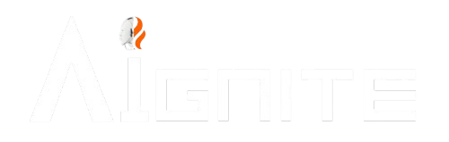

  

# Aignite Repository

Welcome to the official repository for **Aignite**, the AIML department's dynamic webpage for hosting and managing events, news updates, and certificates 
--- 

## About The Project

**Aignite** serves as the central platform for the AIML department's events and updates. Built to enhance accessibility and ease of use, the webpage provides tools for:

- Conducting and managing department-related events.
- Sharing the latest news and announcements.
- Streamlining event registrations for students and staff.
- Facilitating certificate distribution to event participants.

Visit [Aignite.live](https://aignite.live) for a live demonstration of the platform and its features.

---

## Features

### 1. **Event Management**
   - Users can view upcoming events, register online, and stay informed about event details.
   - Organizers can manage participant lists and track registrations efficiently.

### 2. **News and Announcements**
   - A dedicated section for publishing updates, achievements, and important news from the department.

### 3. **Dynamic Registration**
   - Easy-to-use registration forms for events, workshops, and hackathons.

### 4. **Certificate Distribution**
   - Automates the generation and distribution of participation and achievement certificates post-events.

### 5. **Interactive User Experience**
   - Features like chatbots for user interaction and login functionality to manage event participation and certificates.

---

## Built With

Aignite is powered by modern web technologies to ensure a seamless and responsive experience:

- [!Next][next.js][next-url]
- [!React][react.js][react-url]
- [!TailwindCSS][tailwindcss.com][tailwindcss-url]

---
